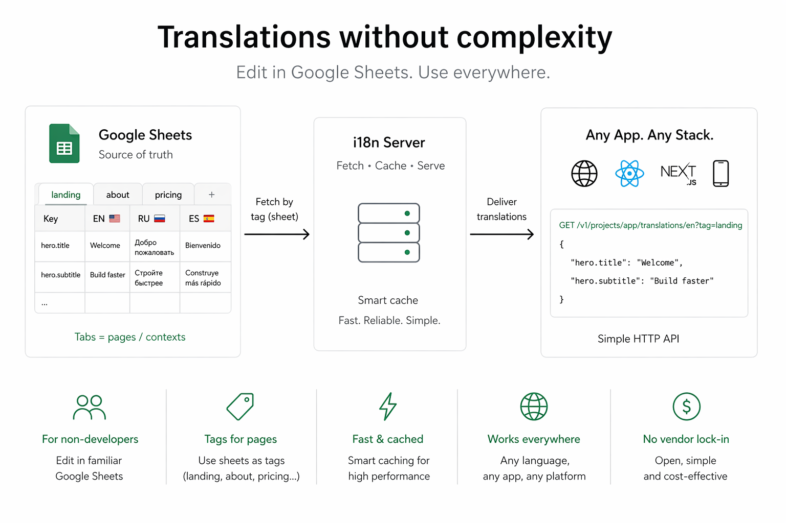
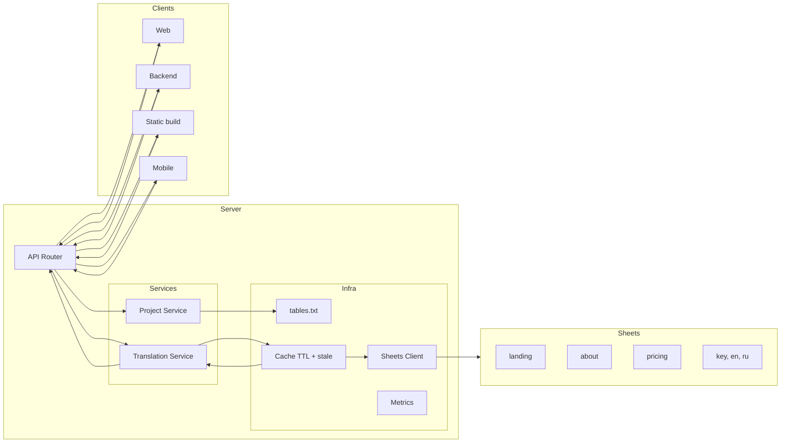

# Google Sheets i18n Server

HTTP service that serves translations stored in Google Sheets — no database, no CMS, no redeploy.



**Stack:** Node.js · ESM · Google Sheets API


## Why

Translation workflows typically fall into one of three traps:

| Approach | Problem |
|---|---|
| JSON files in repo | Every copy change requires a redeploy |
| CMS / i18n platform | Significant cost and vendor lock-in |
| Custom backend | Ongoing maintenance burden |

This service treats Google Sheets as the single source of truth. Non-technical team members edit translations directly; the service fetches, caches, and serves them over HTTP.


## Architecture


## How it works

1. A request arrives for `project / language`
2. The cache layer checks for an active entry
3. On miss — a single request is sent to the Sheets API (concurrent requests share one in-flight Promise to avoid thundering herd)
4. Raw rows are transformed into a nested JSON object
5. The response is cached with stale-while-revalidate semantics and returned

The service is stateless. No database, no disk writes.

## Data model

Each project maps to one Google Sheet. Columns are languages; rows are keys.

| key | en | ru |
|---|---|---|
| home.title | Home | Главная |
| home.cta | Start | Начать |

Rules:

* first column — translation key (dot-notation, maps to nested structure)
* remaining columns — one per language
* first row — headers


## Transformation

Tabular input:

```text
[
  ["key",        "en",    "ru"     ],
  ["home.title", "Home",  "Главная"]
]
```

JSON output:

```json
{
  "home": {
    "title": "Home"
  }
}
```

## Caching

Two properties worth calling out:

**Promise deduplication** — identical concurrent requests share one in-flight Promise. No matter how many simultaneous users hit a cold cache, the Sheets API is called once.

**Stale-while-revalidate** — expired cache entries are returned immediately while a background refresh runs. Latency stays low even as the cache turns over.

Trade-offs: cache is in-process (no distributed invalidation), resets on restart, and can serve stale data within the TTL window.


## API

### `GET /projects`

Returns the list of configured projects.


### `POST /projects`

Register or update a project.

```http
POST /projects
Content-Type: application/json

{
  "name": "my_project",
  "value": "GOOGLE_SHEETS_ID"
}
```


### `GET /v1/projects/:project/translations/:lang`

Returns flat key-value translations.

```json
{ "home.title": "Home" }
```

Add `?format=nested` for a structured object:

```json
{ "home": { "title": "Home" } }
```

Add `?tag=landing` to filter by section tag.


### `GET /langs/:lang/keys/:project`

Legacy endpoint, returns structured translations. Supports `?tag=master`.


## Examples

### Runtime i18next (React)

Load translations in the browser; supports language switching without rebuild.

```tsx
async function loadTranslations({ baseUrl, project, lang }) {
  const response = await fetch(
    `${baseUrl}/v1/projects/${project}/translations/${lang}?format=nested`,
  )
  const resources = await response.json()
  i18n.addResourceBundle(lang, 'translation', resources, true, true)
  await i18n.changeLanguage(lang)
}

export function App({ lang, project, baseUrl }) {
  const [isLoaded, setIsLoaded] = useState(false)

  useEffect(() => {
    loadTranslations({ lang, project, baseUrl }).then(() => setIsLoaded(true))
  }, [lang, project, baseUrl])

  if (!isLoaded) return <div>Loading…</div>
  return <div>{i18n.t('home.title')}</div>
}
```

Full example: [examples/runtime-i18next/](examples/runtime-i18next/)


### Webpack plugin (build-time JSON bundles)

Writes language JSON files into the output directory during build. Drop-in for apps that already load translation JSON at runtime.

```ts
plugins: [
  new SaverLangsPlugin({
    url: 'http://localhost:7996/v1/projects/app/translations/all?tag=master&format=nested',
    outputPath: path.resolve(__dirname, 'dist/i18n'),
    variant: 'main',
    hash: process.env.BUILD_HASH || 'dev',
    languageNames: { en: 'English', ru: 'Русский' },
  }),
]
```

Output:

```text
dist/i18n/languages.main.abc123.json
dist/i18n/en.main.abc123.json
dist/i18n/ru.main.abc123.json
```

Full example: [examples/webpack-plugin/](examples/webpack-plugin/)


### Webpack static generation (build-time HTML)

Fetches translations at build time and generates per-locale static HTML via `HtmlWebpackPlugin`. Best for landing pages and SEO-critical sites.

```js
module.exports = async () => {
  const translations = Object.fromEntries(
    await Promise.all(
      LANGUAGES.map(async lang => [lang, await loadTranslations(lang)]),
    ),
  )

  return {
    plugins: LANGUAGES.map(lang =>
      new HtmlWebpackPlugin({
        template: './src/index.html',
        filename: lang === 'en' ? 'index.html' : `${lang}/index.html`,
        templateParameters: { lang, text: translations[lang] },
      }),
    ),
  }
}
```

Full example: [examples/webpack-static-generation/](examples/webpack-static-generation/)


## Setup

### 1. Install

```bash
npm install
```

### 2. Configure environment

`.env`

```bash
AUTH_KEY=your_google_api_key
PORT=7996
```

### 3. Register projects

`tables.txt`

```txt
my_project=GOOGLE_SHEETS_ID
```

### 4. Run

```bash
npm start
```

## Design decisions

### Google Sheets as a data store

Non-developers can manage translations without learning a CMS. Sheets has built-in history, comments, and access control — features that would require significant effort to replicate.

### No database

The service holds no authoritative data — Google Sheets does. A database would create a sync problem and another thing to operate. Without it, the service is trivially replaceable and horizontally scalable.

### In-memory cache with promise deduplication

A persistent cache (Redis et al.) adds infrastructure and consistency concerns. In-memory is sufficient given that: (a) cache misses go directly to Google, not a slow DB, and (b) promise deduplication means a cold cache under load still makes only one upstream call.

## Limitations

* no write API — translations must be edited in Google Sheets directly
* cache is not distributed — each instance holds its own state
* depends on Google Sheets API availability
* no built-in authentication on translation endpoints

## Possible extensions

* Redis cache with shared invalidation
* Webhook endpoint to trigger cache flush on sheet edit
* Authentication middleware
* CLI tool to snapshot translations into static JSON

## Tests

```bash
npm test          # watch mode
npm run test:run  # single run (used in CI)
```

## License

MIT

Built by [ars33](https://popov.ars.world)

